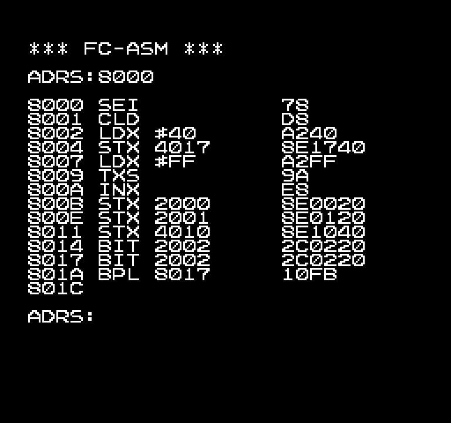

# FC-ASM

Assembler program for Family BASIC V2

## Usage

1. Load/enter the program. 
2. `RUN` the program.
3. Once the `ADRS:` prompt appears, enter the starting address.
4. Enter 6502 assembly code. Press RETURN with nothing entered to return to step 3.

Notes:
- Official instructions only.
- The assembled code is never written anywhere. This is purely for bytecode previews.
- There is no label functionality.
- Addresses & operands are always in hexadecimal, without any prefixes. Examples: `LDA #5A` `LDX 69,Y` `STY 0420`
- Accumulator addressing may be specified with or without the "A". Examples: `ASL` `ROR A`
- Branch offsets may be entered as 2-digit relative addressing or as 4-digit absolute addressing. Offset ranges are verified by the program. Examples: `BNE A5` `BEQ 8000`

## Bugs

The original listing contains an error which causes `LDX zp,Y` to be treated as invalid. This has been fixed in the version hosted here, as it likely would have been corrected in later printings.

Original: `3110 DATA"DキEヌGウJソLマ`
Fixed: `3110 DATA"DキFヌGウJソLマ`

## Screenshot

The original magazine screenshot only contains the address prompt. Example code has been entered in to better demonstrate the program.

