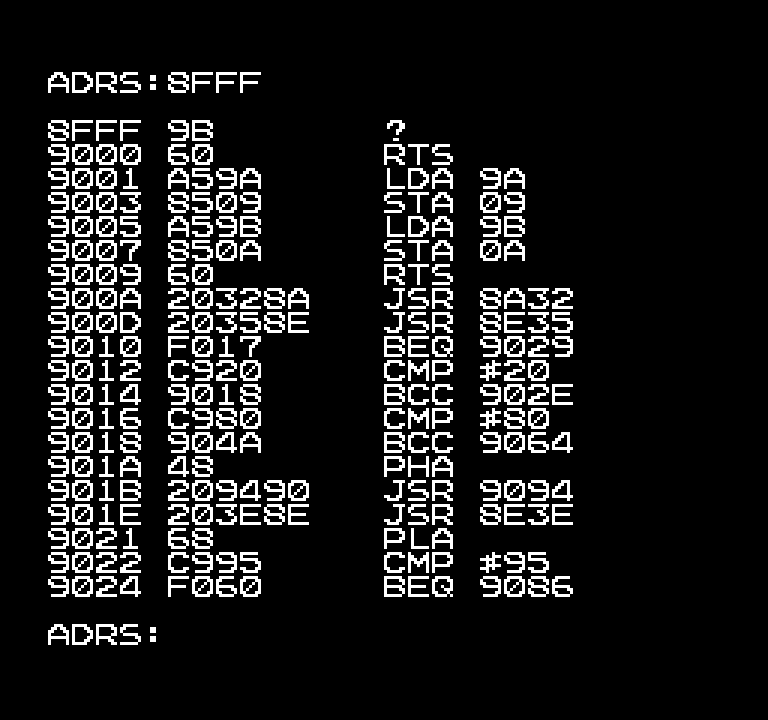

# FC-D.ASM

Disassembler program for Family BASIC V2

## Usage

1. Load/enter the program. 
2. `RUN` the program.
3. Once the `ADRS:` prompt appears, enter the starting address.
4. The program will attempt to disassemble a section of code starting from the specified address.
5. Repeat from step 3.

Notes:
- Official instructions only. Invalid bytes will be displayed with a "?" symbol.
- Addresses & operands are always in hexadecimal, without any prefixes. Examples: `LDA #5A` `LDX 69,Y` `STY 0420`
- The disassembly is performed linearly. Non-linear code execution methods such as unconditional branches, jump tables, inline subroutine arguments, and stack/return address manipulation will not be disassembled correctly.

## Screenshot

The original magazine screenshot lacks the disassembly view. 

