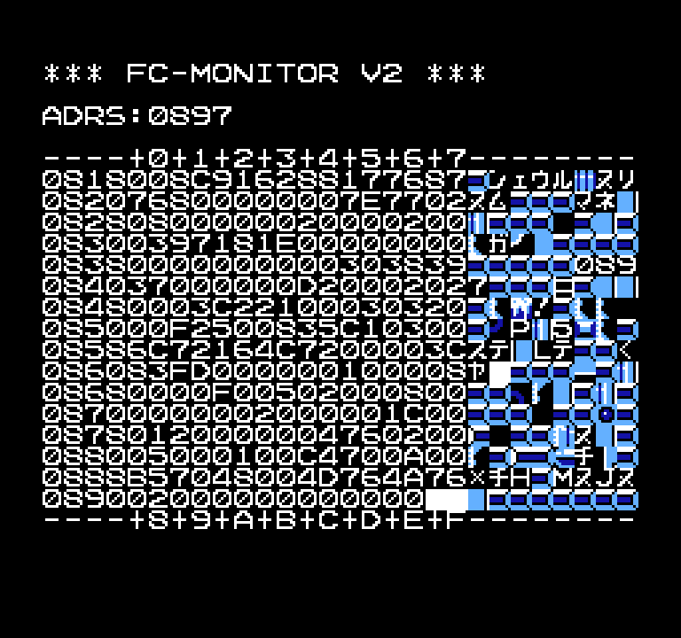

# FC-MONITOR V2

Monitor program for Family BASIC V2

## Memory Allocation

$76C0-$777F: Reserved by monitor helper routines
$7780-$77FF: Free memory

## Usage

1. Load/enter the program. 
2. `RUN` the program.
3. Once the `ADRS:` prompt appears, enter the starting address to monitor.
4. The 128 bytes surrounding the address will be displayed in hexadecimal. Refer to the controls below to view and manipulate the memory contents.

Note: The monitor program takes up most of the free space on the already limited V2 memory. After running the monitor program, run `CLEAR&H77FF` to clear the memory before loading new programs. 

### Keyboard Controls

Be sure to check the emulator's Family BASIC keyboard mapping before pressing these, since the delete key on PC keyboards may be mapped to the STOP key (which will terminate the program). The DEL key is usually mapped to the  backspace key instead.

- RETURN: Return cursor to the address entry (`ADRS:`). The cursor will be located here when starting the program.
- HOME: Reset cursor to the top-left corner.
- DEL: Move up 128 bytes.
- INS: Move down 128 bytes.
- Cursor/Arrow keys: Move the cursor.
- 0-9,A-F keys: Input hexadecimal data at the cursor location. The cursor will automatically move to the next byte after entering 2 nybbles = 1 byte.

## Screenshot

Only the memory contents differ from the original magazine screenshot.

